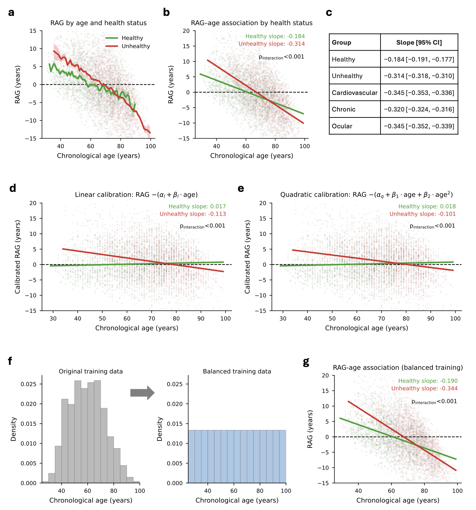
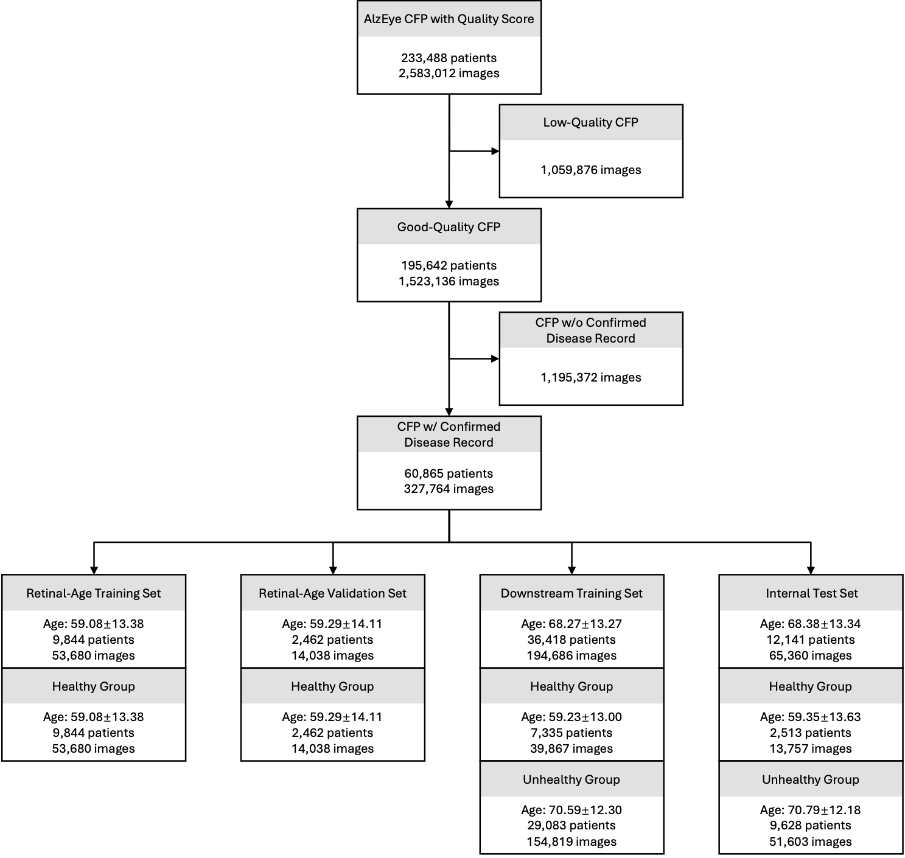
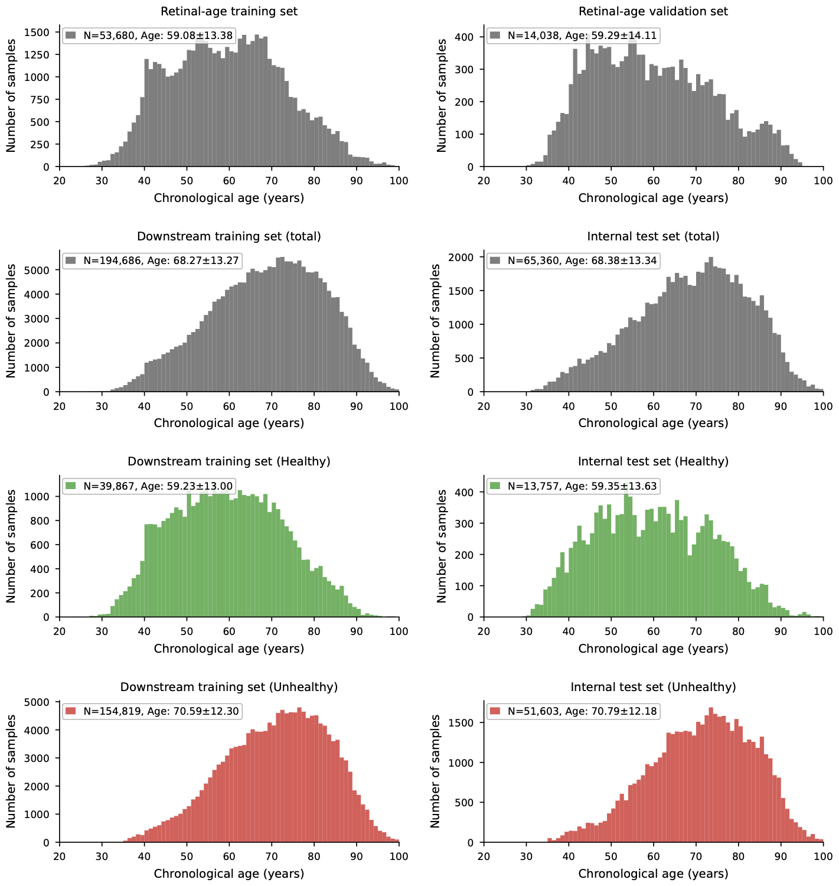

## Differential group RTM effects in retinal age models

> *Full version coming soon.*

### 1. Study design

A deep retinal age model trained on colour fundus photography (CFP) outputs an estimated retinal age $\hat a$. The retinal age gap, $\mathrm{RAG} = \hat a - a$, is interpreted as accelerated (RAG > 0) or decelerated (RAG < 0) biological aging relative to chronological age $a$ (**Fig. 1a**). Because the regressor is trained to minimise prediction error against $a$, predictions revert toward the training-set mean. This is known as the regression-to-the-mean (RTM) effect. We hypothesised that RTM is itself disease-modulated. In unhealthy eyes, the model loses age-specific cues and reverts more strongly than in healthy eyes, producing a differential RTM that has been mistaken in previous works for a true biomarker of biological aging (**Fig. 1b**).

To dissect this confound, we assembled one internal cohort (AlzEye, Moorfields) and three independent external cohorts spanning two continents and four imaging devices. After image-quality filtering and removal of records without confirmed disease labels, the analytic AlzEye cohort comprised 60,865 patients / 327,764 images, with mean ± s.d. age 63.07 ± 11.76 years (**Fig. 1c**, **Supplementary Fig. 1**). Throughout, unhealthy denotes any record with a confirmed non-healthy disease label, with cardiovascular, chronic and ocular as subcategories. The internal cohort was partitioned at the patient level into four non-overlapping sets: a retinal-age training set (9,844 healthy patients / 53,680 images) and a retinal-age validation set (2,462 healthy patients / 14,038 images), used to train the retinal-age model and select its epoch; a downstream training set (36,418 patients / 194,686 images, healthy + unhealthy), used to fit the age-calibrators and the logistic regressions; and an internal test set (12,141 patients / 65,360 images, healthy + unhealthy), used for all internal evaluations. External cohorts were UK Biobank (UKB; 29,835 patients / 51,709 images, Topcon), BRSET (5,529 patients / 10,287 images, Canon + Nikon) and mBRSET (1,277 patients / 5,107 images, Phelcom handheld). Per-set patient counts, image counts and age distributions are shown in **Supplementary Figs. 1–7**.

**Fig. 1. Overview of the study, mechanism, and study cohorts.**
**a.** Retinal age estimation and the retinal age gap (RAG). A deep retinal age model takes a colour fundus photograph (CFP) as the input and outputs an estimated retinal age. The RAG is defined as estimated age minus chronological age: a positive RAG (red) implies faster aging and poorer health, a negative RAG (green) implies slower aging and healthier status, and RAG = 0 (black) reflects average aging at the training-set scale.
**b.** Schematic of differential regression-to-the-mean (RTM), shown in the left column, alongside the empirical RAG–age and OR–age curves on AlzEye in the right column. Top-left: true age distribution (solid) and estimated-age distribution (dashed). Middle-left and bottom-left: schematic prediction patterns for healthy and unhealthy eyes, respectively. Right column (top): empirical mean RAG by 10-year age subgroup. Right column (bottom): implied per-year odds ratio for unhealthy by age subgroup.
**c.** Datasets used in this study. The AlzEye subset was used for internal training and testing, and three external cohorts (UK Biobank, BRSET, mBRSET) were used for external generalisation testing. For each cohort the panel summarises the chronological-age distribution and imaging-device composition. All counts shown are after image-quality and disease-label filtering; full per-split breakdowns are in **Supplementary Figs. 1–7**.

### 2. Retinal age and RAG in the internal cohort

We trained the retinal age model (**Supplementary Fig. 8**) on the retinal-age training set, with the retinal-age validation set used for epoch selection (**Fig. 2a**). The model achieved a mean absolute error (MAE) of 5.31 years, RMSE of 6.80 years, and a mean RAG of −0.86 years on the internal test set (**Fig. 2b**).

On the internal test set, the marginal age-adjusted mean RAG at age 65 was significantly higher in every disease category than in healthy controls (mean RAG: healthy −0.7 yr, unhealthy +0.7 yr, cardiovascular +1.25 yr, chronic +0.65 yr, ocular +1.6 yr; all *P* < 0.001 vs healthy; **Fig. 2c**). A logistic regression with disease as the outcome and RAG as the only predictor returned an odds ratio per +1 year RAG of 1.049 (95% CI: [1.046, 1.053]) for unhealthy, 1.041 (95% CI: [1.036, 1.046]) for cardiovascular disease, 1.048 (95% CI: [1.045, 1.052]) for chronic disease, and 1.065 (95% CI: [1.061, 1.069]) for ocular disease (**Fig. 2d**).

**Fig. 2. Internal retinal age prediction and association with disease on the AlzEye internal test set.**
**a.** Training-set age distribution. Chronological age distribution of the retinal-age training set used to fit the retinal age model (1-year bins). Following previous works, the retinal age model is trained exclusively on healthy patients.
**b.** Internal retinal age model performance. Hexbin density of estimated retinal age vs chronological age on the internal test set; the dashed line is identity. Annotated metrics: Mean Retinal Age Gap (RAG), Mean Absolute Error (MAE) and Root Mean Square Error (RMSE).
**c.** Age-adjusted mean RAG by group. Marginal mean RAG predicted at age 65 for healthy patients and the four disease categories. Error bars: 95% confidence intervals (CIs) from a patient-level cluster bootstrap. *P*-values are computed from the same patient-level cluster bootstrap distribution of the difference in mean RAG between each disease group and the healthy reference.
**d.** Association analysis. Logistic regression was performed with each disease label as the outcome and RAG as the only predictor; reported are Odds Ratios (OR) per +1 year increase in RAG and 95% CIs, with *P*-values from the Wald test.

### 3. Differential RTM by health status

Stratifying RAG by chronological age within disease group revealed a strong, non-zero slope of RAG against age in every group (**Fig. 3a,b**). The healthy slope was −0.184 (95% CI: [−0.191, −0.177]) and the unhealthy slope was −0.314 (95% CI: [−0.318, −0.310]), with $P_{\text{interaction}} < 0.001$. Disease-specific slopes were steeper still: cardiovascular −0.345 (95% CI: [−0.353, −0.336]), chronic −0.320 (95% CI: [−0.324, −0.316]), and ocular −0.345 (95% CI: [−0.352, −0.339]; **Fig. 3c**).

We next asked whether the differential slope between healthy and unhealthy groups could be eliminated by post-hoc calibration. Two age-calibrators were fit on the healthy subset of the downstream training set by regressing raw RAG on chronological age — a linear form $\mathrm{RAG} = \alpha_l + \beta_l \cdot \mathrm{age}$ and a quadratic form $\mathrm{RAG} = \alpha_q + \beta_1 \cdot \mathrm{age} + \beta_2 \cdot \mathrm{age}^2$ — and the calibrated RAG was the residual of raw RAG from the fitted curve. Linear age-calibration flattened the healthy slope to 0.017 (95% CI: [0.011, 0.024]) but only attenuated the unhealthy slope to −0.113 (95% CI: [−0.117, −0.109]); $P_{\text{interaction}} < 0.001$ (**Fig. 3d**). The quadratic calibration yielded essentially the same residual interaction: healthy 0.018 (95% CI: [0.011, 0.024]), unhealthy −0.101 (95% CI: [−0.105, −0.097]); $P_{\text{interaction}} < 0.001$ (**Fig. 3e**). Re-training the retinal age model on a uniform-age training distribution obtained by inverse-frequency resampling (**Fig. 3f**) likewise failed to remove the interaction on the internal test set: healthy −0.190 (95% CI: [−0.196, −0.183]), unhealthy −0.344 (95% CI: [−0.348, −0.340]); $P_{\text{interaction}} < 0.001$ (**Fig. 3g**). The differential slope persisted under all three interventions.

**Fig. 3. Differential RTM by health status persists under linear, quadratic and training-distribution calibration.**
All analyses are on the AlzEye internal test set. Interaction *P*-values ($P_{\text{interaction}}$) are from a Wald test on the age × group coefficient in the corresponding linear regression of RAG on age, group and their interaction.
**a.** Mean RAG vs chronological age stratified by health status (1-year bins). Shaded bands are 95% CIs from a patient-level cluster bootstrap.
**b.** Group-wise linear regression of RAG on chronological age. Slopes are reported with 95% CIs and an interaction term tests whether the healthy and unhealthy slopes differ.
**c.** Slope estimates and 95% CIs for healthy, unhealthy, and the three disease subcategories.
**d–e.** Re-evaluation after applying a linear (d) or quadratic (e) age-calibrator fit on the healthy subset of the downstream training set (see §3 for the fitted form).
**f.** Training-distribution rebalancing. Original training-age distribution (left) and the uniform-age distribution obtained by inverse-frequency resampling (right) used for the balanced-training experiment.
**g.** RAG–age relationship after re-training the retinal age model on the balanced training distribution.

### 4. Utility of RAG in disease classification

We modelled the joint dependence of disease on age and RAG with a logistic regression that included an explicit age × RAG interaction: $\text{logit}(\text{unhealthy}) \sim \text{Age} + \text{RAG} + \text{Age} \times \text{RAG}$. The interaction was highly significant in every disease category. The implied marginal odds ratio per +1 year RAG decreased monotonically with chronological age, from ≈ 1.12 at age 30 to ≈ 1.00 around age 90, falling below 1.00 in the oldest patients (**Fig. 4a**).

Across all four disease categories the Age + RAG + Age × RAG model outperformed both the Age-only and Age + RAG models (**Fig. 4b**). AUCs for Age-only, Age + RAG and Age + RAG + Age × RAG, respectively, were: unhealthy 0.731 (95% CI: [0.726, 0.736]), 0.737 (95% CI: [0.732, 0.742]), 0.741 (95% CI: [0.736, 0.746]); cardiovascular 0.806 (95% CI: [0.800, 0.811]), 0.809 (95% CI: [0.804, 0.814]), 0.813 (95% CI: [0.808, 0.818]); chronic 0.727 (95% CI: [0.722, 0.732]), 0.733 (95% CI: [0.728, 0.738]), 0.737 (95% CI: [0.732, 0.742]); ocular 0.757 (95% CI: [0.752, 0.763]), 0.769 (95% CI: [0.764, 0.775]), 0.774 (95% CI: [0.769, 0.780]). The advantage was concentrated in the youngest age stratum (< 45 years), where the interaction was largest in absolute terms; e.g. ocular AUC 0.579 (95% CI: [0.552, 0.607]), 0.791 (95% CI: [0.770, 0.814]), 0.802 (95% CI: [0.781, 0.824]) under the same three specifications (**Fig. 4c**). Under the Age-only model the decision boundary is a vertical line in age, under Age + RAG a tilted line, and under Age + RAG + Age × RAG a curve whose slope flattens with increasing age (**Fig. 4d**).

**Fig. 4. Utility of RAG in disease classification.**
Logistic regressions are fit on the AlzEye downstream training set; metrics are reported on the AlzEye internal test set.
**a.** Marginal odds ratio per +1 year RAG by chronological age. Implied by the Age + RAG + Age × RAG logistic for the unhealthy outcome. Shaded band: 95% CI from a patient-level cluster bootstrap.
**b.** Discrimination across logistic specifications. AUC for predicting unhealthy / cardiovascular / chronic / ocular disease under three nested models: Age only (blue), Age + RAG (yellow) and Age + RAG + Age × RAG (red). Error bars: 95% CI.
**c.** Age-stratified discrimination. Same models as in b, stratified by chronological-age tertile (< 45, 45–75, ≥ 75).
**d.** Decision boundaries in the (Age, RAG) plane for the three logistic specifications: Age-only (left), Age + RAG (centre) and Age + RAG + Age × RAG (right). Background colour: P(unhealthy); points: held-out test cases.

### 5. Generalisation across external cohorts

We finally evaluated whether the AlzEye-trained retinal-age model, together with the AlzEye-fitted logistics (Age-only and Age + RAG + Age × RAG), transfer across populations and devices. Age-prediction MAE was 3.80 yr in UKB, 7.34 yr in BRSET and 8.40 yr in mBRSET (**Fig. 5a**); mean RAG was strongly cohort-dependent (UKB +1.48, BRSET −0.92, mBRSET −5.70 years). The implied per-year odds-ratio surfaces, derived from an externally calibrated Age + RAG + Age × RAG logistic for each cohort (**Fig. 5b**), reproduced the internal pattern of decreasing OR with age in UKB and BRSET but inverted in mBRSET.

For threshold-free discrimination of unhealthy vs healthy, the AlzEye-trained Age + RAG + Age × RAG logistic achieved an internal AUC of 0.741 (95% CI: [0.715, 0.767]); the chronological-Age-only baseline was 0.731 (95% CI: [0.706, 0.756]). Off-the-shelf transfer to external cohorts dropped AUC under both specifications (**Fig. 5c**). For Age + RAG + Age × RAG: UKB 0.685 (95% CI: [0.675, 0.694]), BRSET 0.664 (95% CI: [0.646, 0.682]), mBRSET 0.614 (95% CI: [0.559, 0.665]). For the Age-only baseline: UKB 0.684 (95% CI: [0.674, 0.693]), BRSET 0.662 (95% CI: [0.644, 0.680]), mBRSET 0.637 (95% CI: [0.582, 0.696]). External calibration only marginally increased the interaction-model AUC: UKB 0.688 (95% CI: [0.679, 0.697]), BRSET 0.671 (95% CI: [0.652, 0.689]), mBRSET 0.638 (95% CI: [0.583, 0.695]). In mBRSET, the Age-only model in fact outperformed the interaction model off-the-shelf.

For threshold-based metrics (**Fig. 5d**), off-the-shelf transfer dropped sensitivity in all three external cohorts (UKB 0.49, BRSET 0.51, mBRSET 0.39; vs internal 0.79), while specificity was preserved or elevated (UKB 0.76, BRSET 0.72, mBRSET 0.74; vs internal 0.57). External calibration restored sensitivity (UKB 0.72, BRSET 0.57, mBRSET 0.82) at the cost of specificity in mBRSET (0.42).

**Fig. 5. Generalisation across external cohorts: UK Biobank, BRSET and mBRSET.**
**a.** External retinal age model performance. Hexbin density of estimated retinal age vs chronological age in each external cohort; the dashed line is identity. Per-cohort MAE, RMSE and mean RAG are annotated in each panel.
**b.** Implied per-year odds-ratio curves. Curves derived from each cohort's externally-calibrated Age + RAG + Age × RAG logistic for the unhealthy outcome, plotted against chronological age. The AlzEye internal curve (grey) is reproduced for reference.
**c–d.** Disease classification metrics across cohorts. Two logistic specifications (Age-only; Age + RAG + Age × RAG) are evaluated on each external cohort in two ways: off-the-shelf, applying the AlzEye-fit logistic without modification (and, for thresholded metrics, reusing the AlzEye internal Youden threshold of 0.742); and externally calibrated, refitting the logistic on each external cohort's own training split and re-deriving the threshold as the cohort-specific Youden point. The AlzEye internal cell uses off-the-shelf only (no recalibration on internal data). **c**, AUC. **d**, Sensitivity, specificity and F1 at the per-cell operating threshold. Dashed lines: AlzEye internal references. Error bars: 95% CI from a patient-level cluster bootstrap.

### Appendix

**Supplementary Fig. 1. Data curation flowchart for the AlzEye dataset.** The dataset was filtered to retain only good-quality CFPs with age and confirmed disease records. The analytic cohort was then partitioned at the patient level into four non-overlapping sets: a retinal-age training set and a retinal-age validation set (healthy only), used to train the retinal-age model and select its epoch; a downstream training set (healthy + unhealthy), used to fit the age-calibrators and the logistic regressions; and an internal test set (healthy + unhealthy), used for all internal evaluations.

**Supplementary Fig. 2. Data curation flowchart for the UK Biobank (UKB) dataset.** The dataset was filtered to retain only good-quality CFPs with age and confirmed disease records. The analytic cohort was then split 50/50 at the patient level (random split), into a training split (used only for external calibration) and a test split (used only for evaluation).

**Supplementary Fig. 3. Data curation flowchart for the BRSET and mBRSET datasets.** Each dataset was filtered to retain only good-quality CFPs with age and confirmed disease records, then split 50/50 at the patient level (random split), into training and test splits used as in Supplementary Fig. 2. **a.** BRSET. **b.** mBRSET; mBRSET has a substantially smaller healthy-patient count per split than the other external cohorts.

**Supplementary Fig. 4. AlzEye chronological-age distributions per set.** Histograms with 1-year bins; per-panel legends report N and age mean ± s.d. Four columns correspond to the four AlzEye sets: retinal-age training set, retinal-age validation set, downstream training set, internal test set. The downstream training and internal test sets are further split into healthy (green) and unhealthy (red) sub-distributions on top of the total (grey). Unhealthy patients are systematically older than healthy patients in both the downstream training and internal test sets.

**Supplementary Fig. 5. UK Biobank chronological-age distributions per split.** 3 × 2 layout: train (left column) vs test (right column); total (grey), healthy (green) and unhealthy (red) by row. 1-year bins; per-panel legends report N and age mean ± s.d. UKB exhibits a narrow age range by recruitment design (40–69 at baseline).

**Supplementary Fig. 6. BRSET chronological-age distributions per split.** Same layout as Supplementary Fig. 5. BRSET has the widest age spread of any external cohort, including paediatric and elderly patients.

**Supplementary Fig. 7. mBRSET chronological-age distributions per split.** Same layout as Supplementary Fig. 5. The small per-split healthy-patient count is notable.

**Supplementary Fig. 8. Retinal age model architecture.** A colour fundus photograph (resized to 224 × 224) is encoded by a DINOv3-Large vision transformer backbone. Patch tokens (excluding the prefix / class token) are mean-pooled and layer-normalised, then passed through a two-layer regression head (Linear [1024 → 32] → ReLU → Dropout (0.5) → Linear [32 → 1]) to produce the estimated retinal age. The backbone is fine-tuned end-to-end against the chronological age target under a mean-squared-error (MSE) loss.
